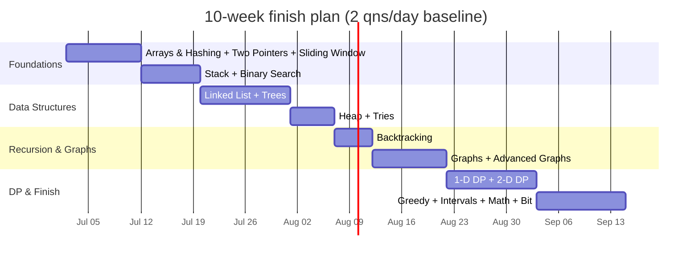

<div align="center">

# 🧠 The 150 Grind — Akshay's DSA Journey

### _2 problems a day. Every day. No excuses._


</div>

---

## 🎯 The Pact

> **Goal:** Solve the full 150-problem DSA roadmap.
> **Minimum pace:** `2 problems / day` — no zero days.
> **Languages:** `C++` (primary) · `C#` (secondary)
> **Finish target:** `~75 days` at pace · **stretch goal:** `60 days`

---

## 📊 Live Stats

<!-- AUTO:STATS:START — do not edit; regenerated by Update-Stats.ps1 -->
<div align="center">


</div>

### Overall

| Metric | Value | Target |
|:---|:---:|:---:|
| 🎯 **Solved** | `13 / 150` | `150` |
| 📅 **Days active** | `9` | — |
| 📈 **Avg / day** | `0.62 behind` | `>= 2.0` |
| 🔥 **Current streak** | `2 days` | keep alive |
| 🏆 **Longest streak** | `2 days` | beat it |
| ⏱️ **Avg time / problem** | `not tracked yet` | `< 30 min` |
| 🔁 **Solved without hints** | `0` | maximize |
| 📅 **Started** | `2026-06-19` | — |
| 🏁 **ETA at current pace** | `2027-02-15` | — |

### By difficulty

| | 🟢 Easy | 🟡 Medium | 🔴 Hard |
|:--|:-:|:-:|:-:|
| **Solved** | `7 / 28` | `6 / 101` | `0 / 21` |
| **Progress** | `▰▰▰▰▱▱▱▱▱▱▱▱▱▱▱` | `▰▱▱▱▱▱▱▱▱▱▱▱▱▱▱` | `▱▱▱▱▱▱▱▱▱▱▱▱▱▱▱` |

### By language

| Language | Solved | Share |
|:--|:-:|:-:|
|  | `7` | `28%` |
|  | `18` | `72%` |

_Last auto-update: 2026-07-09 17:54 · Run `Update-Stats.ps1` to refresh._
<!-- AUTO:STATS:END -->

---

## 🎯 The Roadmap

<!-- AUTO:ROADMAP:START — do not edit; regenerated by Update-Stats.ps1 -->
<div align="center">

| # | Topic | Count | Progress |
|:-:|:--|:-:|:-:|
| 1 | [Arrays & Hashing](#1-arrays--hashing) | 9 | `▱▱▱▱▱▱▱▱▱` 0/9 |
| 2 | [Two Pointers](#2-two-pointers) | 5 | `▱▱▱▱▱` 0/5 |
| 3 | [Sliding Window](#3-sliding-window) | 6 | `▱▱▱▱▱▱` 0/6 |
| 4 | [Stack](#4-stack) | 7 | `▱▱▱▱▱▱▱` 0/7 |
| 5 | [Binary Search](#5-binary-search) | 7 | `▰▱▱▱▱▱▱` 1/7 |
| 6 | [Linked List](#6-linked-list) | 11 | `▱▱▱▱▱▱▱▱▱▱▱` 0/11 |
| 7 | [Trees](#7-trees) | 15 | `▰▰▰▰▰▰▰▰▰▰▰▰▱▱▱` 12/15 |
| 8 | [Heap / Priority Queue](#8-heap--priority-queue) | 7 | `▱▱▱▱▱▱▱` 0/7 |
| 9 | [Backtracking](#9-backtracking) | 9 | `▱▱▱▱▱▱▱▱▱` 0/9 |
| 10 | [Tries](#10-tries) | 3 | `▱▱▱` 0/3 |
| 11 | [Graphs](#11-graphs) | 13 | `▱▱▱▱▱▱▱▱▱▱▱▱▱` 0/13 |
| 12 | [Advanced Graphs](#12-advanced-graphs) | 6 | `▱▱▱▱▱▱` 0/6 |
| 13 | [1-D Dynamic Programming](#13-1-d-dynamic-programming) | 12 | `▱▱▱▱▱▱▱▱▱▱▱▱` 0/12 |
| 14 | [2-D Dynamic Programming](#14-2-d-dynamic-programming) | 11 | `▱▱▱▱▱▱▱▱▱▱▱` 0/11 |
| 15 | [Greedy](#15-greedy) | 8 | `▱▱▱▱▱▱▱▱` 0/8 |
| 16 | [Intervals](#16-intervals) | 6 | `▱▱▱▱▱▱` 0/6 |
| 17 | [Math & Geometry](#17-math--geometry) | 8 | `▱▱▱▱▱▱▱▱` 0/8 |
| 18 | [Bit Manipulation](#18-bit-manipulation) | 7 | `▱▱▱▱▱▱▱` 0/7 |

</div>
<!-- AUTO:ROADMAP:END -->

> 💡 **Tip:** Fill each `▱` with `▰` as you solve. Or drop a tick in the tables below and let your eyes count the wins.

---

## 📚 Problem Tracker

<sub>Legend: 🟢 Easy · 🟡 Medium · 🔴 Hard · ✅ Solved · 🔁 Revisit · ⬜ Todo</sub>

### 1. Arrays & Hashing

| ✓ | Problem | Difficulty | Solution | Notes |
|:-:|:--|:-:|:-:|:--|
| ⬜ | Contains Duplicate | 🟢 | [_link_](#) | |
| ⬜ | Valid Anagram | 🟢 | [_link_](#) | |
| ⬜ | Two Sum | 🟢 | [_link_](#) | |
| ⬜ | Group Anagrams | 🟡 | [_link_](#) | |
| ⬜ | Top K Frequent Elements | 🟡 | [_link_](#) | |
| ⬜ | Encode and Decode Strings | 🟡 | [_link_](#) | |
| ⬜ | Product of Array Except Self | 🟡 | [_link_](#) | |
| ⬜ | Valid Sudoku | 🟡 | [_link_](#) | |
| ⬜ | Longest Consecutive Sequence | 🟡 | [_link_](#) | |

### 2. Two Pointers

| ✓ | Problem | Difficulty | Solution | Notes |
|:-:|:--|:-:|:-:|:--|
| ⬜ | Valid Palindrome | 🟢 | [_link_](#) | |
| ⬜ | Two Sum II | 🟡 | [_link_](#) | |
| ⬜ | 3Sum | 🟡 | [_link_](#) | |
| ⬜ | Container With Most Water | 🟡 | [_link_](#) | |
| ⬜ | Trapping Rain Water | 🔴 | [_link_](#) | |

### 3. Sliding Window

| ✓ | Problem | Difficulty | Solution | Notes |
|:-:|:--|:-:|:-:|:--|
| ⬜ | Best Time to Buy and Sell Stock | 🟢 | [_link_](#) | |
| ⬜ | Longest Substring Without Repeating Characters | 🟡 | [_link_](#) | |
| ⬜ | Longest Repeating Character Replacement | 🟡 | [_link_](#) | |
| ⬜ | Permutation in String | 🟡 | [_link_](#) | |
| ⬜ | Minimum Window Substring | 🔴 | [_link_](#) | |
| ⬜ | Sliding Window Maximum | 🔴 | [_link_](#) | |

### 4. Stack

| ✓ | Problem | Difficulty | Solution | Notes |
|:-:|:--|:-:|:-:|:--|
| ⬜ | Valid Parentheses | 🟢 | [_link_](#) | |
| ⬜ | Min Stack | 🟡 | [_link_](#) | |
| ⬜ | Evaluate Reverse Polish Notation | 🟡 | [_link_](#) | |
| ⬜ | Generate Parentheses | 🟡 | [_link_](#) | |
| ⬜ | Daily Temperatures | 🟡 | [_link_](#) | |
| ⬜ | Car Fleet | 🟡 | [_link_](#) | |
| ⬜ | Largest Rectangle in Histogram | 🔴 | [_link_](#) | |

### 5. Binary Search

| ✓ | Problem | Difficulty | Solution | Notes |
|:-:|:--|:-:|:-:|:--|
| ⬜ | Binary Search | 🟢 | [_link_](#) | |
| ⬜ | Search a 2D Matrix | 🟡 | [_link_](#) | |
| ⬜ | Koko Eating Bananas | 🟡 | [_link_](#) | |
| ⬜ | Find Minimum in Rotated Sorted Array | 🟡 | [_link_](#) | |
| ⬜ | Search in Rotated Sorted Array | 🟡 | [_link_](#) | |
| ⬜ | Time Based Key-Value Store | 🟡 | [_link_](#) | |
| ⬜ | Median of Two Sorted Arrays | 🔴 | [_link_](#) | |

### 6. Linked List

| ✓ | Problem | Difficulty | Solution | Notes |
|:-:|:--|:-:|:-:|:--|
| ⬜ | Reverse Linked List | 🟢 | [_link_](#) | |
| ⬜ | Merge Two Sorted Lists | 🟢 | [_link_](#) | |
| ⬜ | Reorder List | 🟡 | [_link_](#) | |
| ⬜ | Remove Nth Node From End of List | 🟡 | [_link_](#) | |
| ⬜ | Copy List With Random Pointer | 🟡 | [_link_](#) | |
| ⬜ | Add Two Numbers | 🟡 | [_link_](#) | |
| ⬜ | Linked List Cycle | 🟢 | [_link_](#) | |
| ⬜ | Find the Duplicate Number | 🟡 | [_link_](#) | |
| ⬜ | LRU Cache | 🟡 | [_link_](#) | |
| ⬜ | Merge K Sorted Lists | 🔴 | [_link_](#) | |
| ⬜ | Reverse Nodes In K-Group | 🔴 | [_link_](#) | |

### 7. Trees

| ✓ | Problem | Difficulty | Solution | Notes |
|:-:|:--|:-:|:-:|:--|
| ⬜ | Invert Binary Tree | 🟢 | [_link_](#) | |
| ⬜ | Maximum Depth of Binary Tree | 🟢 | [_link_](#) | |
| ⬜ | Diameter of Binary Tree | 🟢 | [_link_](#) | |
| ⬜ | Balanced Binary Tree | 🟢 | [_link_](#) | |
| ⬜ | Same Tree | 🟢 | [_link_](#) | |
| ⬜ | Subtree of Another Tree | 🟢 | [_link_](#) | |
| ⬜ | Lowest Common Ancestor of a BST | 🟡 | [_link_](#) | |
| ⬜ | Binary Tree Level Order Traversal | 🟡 | [_link_](#) | |
| ⬜ | Binary Tree Right Side View | 🟡 | [_link_](#) | |
| ⬜ | Count Good Nodes in Binary Tree | 🟡 | [_link_](#) | |
| ⬜ | Validate Binary Search Tree | 🟡 | [_link_](#) | |
| ⬜ | Kth Smallest Element in a BST | 🟡 | [_link_](#) | |
| ⬜ | Construct Binary Tree from Preorder and Inorder Traversal | 🟡 | [_link_](#) | |
| ⬜ | Binary Tree Maximum Path Sum | 🔴 | [_link_](#) | |
| ⬜ | Serialize and Deserialize Binary Tree | 🔴 | [_link_](#) | |

### 8. Heap / Priority Queue

| ✓ | Problem | Difficulty | Solution | Notes |
|:-:|:--|:-:|:-:|:--|
| ⬜ | Kth Largest Element in a Stream | 🟢 | [_link_](#) | |
| ⬜ | Last Stone Weight | 🟢 | [_link_](#) | |
| ⬜ | K Closest Points to Origin | 🟡 | [_link_](#) | |
| ⬜ | Kth Largest Element in an Array | 🟡 | [_link_](#) | |
| ⬜ | Task Scheduler | 🟡 | [_link_](#) | |
| ⬜ | Design Twitter | 🟡 | [_link_](#) | |
| ⬜ | Find Median from Data Stream | 🔴 | [_link_](#) | |

### 9. Backtracking

| ✓ | Problem | Difficulty | Solution | Notes |
|:-:|:--|:-:|:-:|:--|
| ⬜ | Subsets | 🟡 | [_link_](#) | |
| ⬜ | Combination Sum | 🟡 | [_link_](#) | |
| ⬜ | Permutations | 🟡 | [_link_](#) | |
| ⬜ | Subsets II | 🟡 | [_link_](#) | |
| ⬜ | Combination Sum II | 🟡 | [_link_](#) | |
| ⬜ | Word Search | 🟡 | [_link_](#) | |
| ⬜ | Palindrome Partitioning | 🟡 | [_link_](#) | |
| ⬜ | Letter Combinations of a Phone Number | 🟡 | [_link_](#) | |
| ⬜ | N-Queens | 🔴 | [_link_](#) | |

### 10. Tries

| ✓ | Problem | Difficulty | Solution | Notes |
|:-:|:--|:-:|:-:|:--|
| ⬜ | Implement Trie (Prefix Tree) | 🟡 | [_link_](#) | |
| ⬜ | Design Add and Search Words Data Structure | 🟡 | [_link_](#) | |
| ⬜ | Word Search II | 🔴 | [_link_](#) | |

### 11. Graphs

| ✓ | Problem | Difficulty | Solution | Notes |
|:-:|:--|:-:|:-:|:--|
| ⬜ | Number of Islands | 🟡 | [_link_](#) | |
| ⬜ | Max Area of Island | 🟡 | [_link_](#) | |
| ⬜ | Clone Graph | 🟡 | [_link_](#) | |
| ⬜ | Walls and Gates | 🟡 | [_link_](#) | |
| ⬜ | Rotting Oranges | 🟡 | [_link_](#) | |
| ⬜ | Pacific Atlantic Water Flow | 🟡 | [_link_](#) | |
| ⬜ | Surrounded Regions | 🟡 | [_link_](#) | |
| ⬜ | Course Schedule | 🟡 | [_link_](#) | |
| ⬜ | Course Schedule II | 🟡 | [_link_](#) | |
| ⬜ | Graph Valid Tree | 🟡 | [_link_](#) | |
| ⬜ | Number of Connected Components in an Undirected Graph | 🟡 | [_link_](#) | |
| ⬜ | Redundant Connection | 🟡 | [_link_](#) | |
| ⬜ | Word Ladder | 🔴 | [_link_](#) | |

### 12. Advanced Graphs

| ✓ | Problem | Difficulty | Solution | Notes |
|:-:|:--|:-:|:-:|:--|
| ⬜ | Reconstruct Itinerary | 🔴 | [_link_](#) | |
| ⬜ | Min Cost to Connect All Points | 🟡 | [_link_](#) | |
| ⬜ | Network Delay Time | 🟡 | [_link_](#) | |
| ⬜ | Swim in Rising Water | 🔴 | [_link_](#) | |
| ⬜ | Alien Dictionary | 🔴 | [_link_](#) | |
| ⬜ | Cheapest Flights Within K Stops | 🟡 | [_link_](#) | |

### 13. 1-D Dynamic Programming

| ✓ | Problem | Difficulty | Solution | Notes |
|:-:|:--|:-:|:-:|:--|
| ⬜ | Climbing Stairs | 🟢 | [_link_](#) | |
| ⬜ | Min Cost Climbing Stairs | 🟢 | [_link_](#) | |
| ⬜ | House Robber | 🟡 | [_link_](#) | |
| ⬜ | House Robber II | 🟡 | [_link_](#) | |
| ⬜ | Longest Palindromic Substring | 🟡 | [_link_](#) | |
| ⬜ | Palindromic Substrings | 🟡 | [_link_](#) | |
| ⬜ | Decode Ways | 🟡 | [_link_](#) | |
| ⬜ | Coin Change | 🟡 | [_link_](#) | |
| ⬜ | Maximum Product Subarray | 🟡 | [_link_](#) | |
| ⬜ | Word Break | 🟡 | [_link_](#) | |
| ⬜ | Longest Increasing Subsequence | 🟡 | [_link_](#) | |
| ⬜ | Partition Equal Subset Sum | 🟡 | [_link_](#) | |

### 14. 2-D Dynamic Programming

| ✓ | Problem | Difficulty | Solution | Notes |
|:-:|:--|:-:|:-:|:--|
| ⬜ | Unique Paths | 🟡 | [_link_](#) | |
| ⬜ | Longest Common Subsequence | 🟡 | [_link_](#) | |
| ⬜ | Best Time to Buy and Sell Stock With Cooldown | 🟡 | [_link_](#) | |
| ⬜ | Coin Change II | 🟡 | [_link_](#) | |
| ⬜ | Target Sum | 🟡 | [_link_](#) | |
| ⬜ | Interleaving String | 🟡 | [_link_](#) | |
| ⬜ | Longest Increasing Path in a Matrix | 🔴 | [_link_](#) | |
| ⬜ | Distinct Subsequences | 🔴 | [_link_](#) | |
| ⬜ | Edit Distance | 🟡 | [_link_](#) | |
| ⬜ | Burst Balloons | 🔴 | [_link_](#) | |
| ⬜ | Regular Expression Matching | 🔴 | [_link_](#) | |

### 15. Greedy

| ✓ | Problem | Difficulty | Solution | Notes |
|:-:|:--|:-:|:-:|:--|
| ⬜ | Maximum Subarray | 🟡 | [_link_](#) | |
| ⬜ | Jump Game | 🟡 | [_link_](#) | |
| ⬜ | Jump Game II | 🟡 | [_link_](#) | |
| ⬜ | Gas Station | 🟡 | [_link_](#) | |
| ⬜ | Hand of Straights | 🟡 | [_link_](#) | |
| ⬜ | Merge Triplets to Form Target Triplet | 🟡 | [_link_](#) | |
| ⬜ | Partition Labels | 🟡 | [_link_](#) | |
| ⬜ | Valid Parenthesis String | 🟡 | [_link_](#) | |

### 16. Intervals

| ✓ | Problem | Difficulty | Solution | Notes |
|:-:|:--|:-:|:-:|:--|
| ⬜ | Insert Interval | 🟡 | [_link_](#) | |
| ⬜ | Merge Intervals | 🟡 | [_link_](#) | |
| ⬜ | Non Overlapping Intervals | 🟡 | [_link_](#) | |
| ⬜ | Meeting Rooms | 🟢 | [_link_](#) | |
| ⬜ | Meeting Rooms II | 🟡 | [_link_](#) | |
| ⬜ | Minimum Interval to Include Each Query | 🔴 | [_link_](#) | |

### 17. Math & Geometry

| ✓ | Problem | Difficulty | Solution | Notes |
|:-:|:--|:-:|:-:|:--|
| ⬜ | Rotate Image | 🟡 | [_link_](#) | |
| ⬜ | Spiral Matrix | 🟡 | [_link_](#) | |
| ⬜ | Set Matrix Zeroes | 🟡 | [_link_](#) | |
| ⬜ | Happy Number | 🟢 | [_link_](#) | |
| ⬜ | Plus One | 🟢 | [_link_](#) | |
| ⬜ | Pow(x, n) | 🟡 | [_link_](#) | |
| ⬜ | Multiply Strings | 🟡 | [_link_](#) | |
| ⬜ | Detect Squares | 🟡 | [_link_](#) | |

### 18. Bit Manipulation

| ✓ | Problem | Difficulty | Solution | Notes |
|:-:|:--|:-:|:-:|:--|
| ⬜ | Single Number | 🟢 | [_link_](#) | |
| ⬜ | Number of 1 Bits | 🟢 | [_link_](#) | |
| ⬜ | Counting Bits | 🟢 | [_link_](#) | |
| ⬜ | Reverse Bits | 🟢 | [_link_](#) | |
| ⬜ | Missing Number | 🟢 | [_link_](#) | |
| ⬜ | Sum of Two Integers | 🟡 | [_link_](#) | |
| ⬜ | Reverse Integer | 🟡 | [_link_](#) | |

---

## 🧾 Solving Log

<sub>Latest first — one line per problem. Future-you will thank present-you.</sub>

<details open>
<summary><b>Recent sessions</b></summary>

| Date | # | Problem | Topic | Diff | Time | Lang | Notes |
|:--|:-:|:--|:--|:-:|:-:|:-:|:--|
| `YYYY-MM-DD` | 1 | _Two Sum_ | Arrays & Hashing | 🟢 | 12 min | C++ | Hash map, one-pass |
| `YYYY-MM-DD` | 2 | _Valid Anagram_ | Arrays & Hashing | 🟢 | 8 min | C# | Sort + compare, then freq map |
| _..._ | _..._ | _..._ | _..._ | _..._ | _..._ | _..._ | _..._ |

</details>

---

## 📅 Daily Discipline

**The rule:** 2 problems logged before bed. No exceptions. Sick day = 1 easy + note in log.

| Day type | Minimum | Ideal |
|:--|:-:|:-:|
| 🟢 Regular weekday | 2 | 3 |
| 🟡 Busy day | 2 | 2 |
| 🔴 Sick / travel | 1 (+ note) | 2 |
| 🟣 Weekend | 3 | 4-5 |

**Weekly cadence: ~15 problems → finish the 150 in 10 weeks.**



---

## 🧭 My Solving Workflow

```mermaid
flowchart LR
    A[Pick next problem] --> B[Read 2x, restate in own words]
    B --> C[Brute force first — always]
    C --> D[Identify pattern / optimize]
    D --> E[Code in C++ or C#]
    E --> F[Test edge cases by hand]
    F --> G{Passed?}
    G -- Yes --> H[Write 2-line note above solution]
    G -- No, stuck 30 min --> I[Read editorial / hint]
    I --> J[Re-implement from scratch, closed tab]
    J --> H
    H --> K[Mark solved in tracker]
    K --> L[Add to revisit queue if hard]
```



### Rules of engagement

- ⏳ **30-minute rule** — stuck for 30 min? Peek at a hint. Stuck 60? Read the editorial, then re-implement from scratch.
- ✍️ **Note-above-code** — every solution starts with a 2-line comment: _pattern used_ + _time/space_.
- 🔁 **Revisit hards** — every 🔴 goes into a "redo in 3 days" queue.
- 🌐 **Both languages** — solve in C++ first, port tricky ones to C# for interview flexibility.

---

## 📁 Repository Layout

```
<topic-folder>/
  <problem-id>/
    submission-0.cpp     ← C++ solution
    submission-1.cs      ← C# port (optional)
    notes.md             ← optional: pattern + pitfalls
```

**Example**

```
Arrays & Hashing/two-sum/submission-0.cpp
Arrays & Hashing/two-sum/submission-1.cs
Trees/binary-tree-max-path-sum/submission-0.cpp
```

### File header template

Every solution file starts with:

```cpp
// Problem : Two Sum
// Topic   : Arrays & Hashing   |  Difficulty: Easy
// Pattern : Hash map, single pass
// Time    : O(n)  |  Space: O(n)
// Solved  : 2026-07-02  |  Attempt: 1  |  Hints used: no
```

---

## 🎯 Weekly Goals

- [ ] Hit **14 problems / week** (2/day floor)
- [ ] Solve **at least 1 🔴 hard** per week
- [ ] Revisit any hard within **3 days**
- [ ] Write a **pattern summary note** at the end of every topic
- [ ] Port **2 problems to C#** every week for cross-language fluency

---

## 🧠 Patterns Cheat-Sheet

<sub>Growing list — add a one-liner each time a new pattern clicks.</sub>

| Pattern | When to reach for it | Example problems |
|:--|:--|:--|
| Hash map lookup | Need O(1) "have I seen this?" | Two Sum, Contains Duplicate |
| Two pointers | Sorted array, pair/triplet, palindrome | 3Sum, Valid Palindrome |
| Sliding window | Contiguous subarray/substring with a constraint | Longest Substring, Min Window |
| Monotonic stack | "Next greater/smaller" | Daily Temperatures, Largest Rectangle |
| Binary search on answer | Min/max feasible value | Koko Bananas, Ship Packages |
| Fast + slow pointers | Cycle / middle in linked list | Linked List Cycle, Find Duplicate |
| BFS / DFS on grid | Islands, regions, shortest path | Number of Islands, Rotting Oranges |
| Topological sort | Ordering with prerequisites | Course Schedule |
| Union-Find | Connectivity, cycle in undirected | Redundant Connection |
| DP (1-D) | Optimal at index i from prior states | House Robber, LIS |
| DP (2-D) | Two changing dimensions | LCS, Edit Distance |
| Backtracking | Enumerate combinations/permutations | Subsets, N-Queens |
| Greedy | Local optimum → global optimum | Jump Game, Gas Station |
| Bit manipulation | Space-optimal state / XOR tricks | Single Number, Counting Bits |

---

## 🚧 Stuck Problems Queue

<sub>Problems I bailed on or want to redo cold. Clear it weekly.</sub>

| Problem | Topic | Diff | Bailed on | Retry by | Status |
|:--|:--|:-:|:--|:--|:-:|
| _—_ | _—_ | _—_ | _—_ | _—_ | _—_ |

---

## 🔗 Quick References

| Resource | Why |
|:--|:--|
| [Big-O Cheatsheet](https://www.bigocheatsheet.com/) | Complexity lookup on demand |
| [C++ Reference](https://en.cppreference.com/) | STL containers & algorithms |
| [C# Docs](https://learn.microsoft.com/en-us/dotnet/csharp/) | LINQ, collections, generics |
| [Visualgo](https://visualgo.net/en) | Animated data structures |
| [LeetCode Patterns](https://seanprashad.com/leetcode-patterns/) | Pattern-based drilling |

---

<div align="center">

### _"Discipline is choosing between what you want now and what you want most."_

**Two a day. Every day. 150 days from zero to fluent.**

</div>
